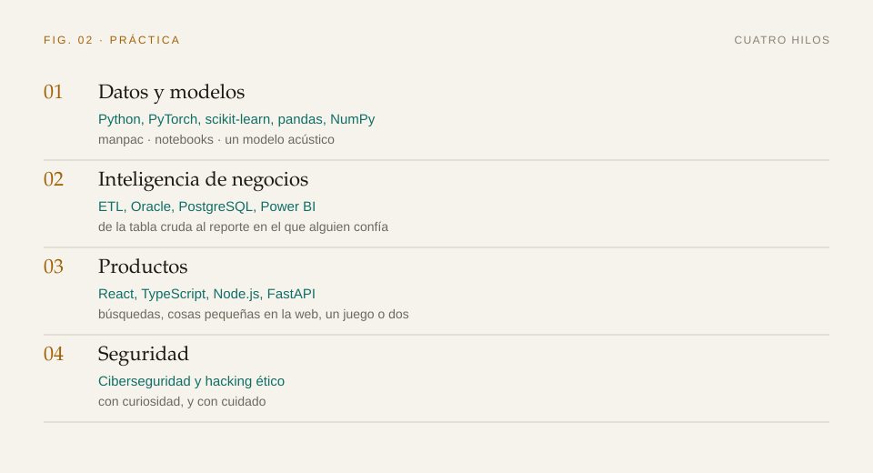

<a href="https://github.com/jose-JQ">
  <picture>
    <source media="(prefers-color-scheme: dark)" srcset="assets/banner-es-dark.svg">
    <source media="(prefers-color-scheme: light)" srcset="assets/banner-es-light.svg">
    
  </picture>
</a>

  <a href="https://github.com/jose-JQ">
    <picture>
      <source media="(prefers-color-scheme: dark)" srcset="assets/lang-en-off-dark.svg">
      <source media="(prefers-color-scheme: light)" srcset="assets/lang-en-off-light.svg">
      
    </picture>
  </a>
  &nbsp;
  <a href="https://github.com/jose-JQ/jose-JQ/blob/main/README.es.md">
    <picture>
      <source media="(prefers-color-scheme: dark)" srcset="assets/lang-es-on-dark.svg">
      <source media="(prefers-color-scheme: light)" srcset="assets/lang-es-on-light.svg">
      
    </picture>
  </a>

Me apasiona la computación. Me mueve lo que puede la **innovación tecnológica**, y lo que la **ciencia de datos**, el **aprendizaje automático** y la **inteligencia artificial** alcanzan a resolver cuando el problema es concreto.

Hoy trabajo en acortar la distancia entre el dato crudo y una decisión que sirva: diseñar pipelines de ETL que aguanten, explorar recomendadores que miran la secuencia, o construir aplicaciones full-stack.

## En qué trabajo

  <picture>
    <source media="(prefers-color-scheme: dark)" srcset="assets/practice-es-dark.svg">
    <source media="(prefers-color-scheme: light)" srcset="assets/practice-es-light.svg">
    
  </picture>

### Foco

* **Ciencia de datos y ML:** analítica predictiva, pronóstico de series de tiempo y equidad algorítmica.
* **Inteligencia de negocios:** integración de datos, bases exigentes (Oracle, PostgreSQL) y reportes automáticos con Power BI.
* **Desarrollo de software:** soluciones modulares con Python, React, TypeScript y Node.js.

### En público

- [manpac](https://github.com/jose-JQ/manpac) — leer facturas de vehículos con modelos, y después revisar el resultado
- [Búsqueda IR](https://github.com/jose-JQ/busqueda_ir) — TF-IDF y BM25, con una interfaz en React
- [Quantic Search](https://github.com/jose-JQ/rag_multimodal) — recuperar a partir de texto e imágenes a la vez
- [hci_tron_game](https://github.com/jose-JQ/hci_tron_game) — un juego en TypeScript, con una API pequeña al lado
- [Fueguito](https://github.com/jose-JQ/Fueguito) — una llamita que sigue al cursor
- [Interpolador de funciones](https://github.com/jose-JQ/Interpolador-de-Funciones--ModSim) — un modelo acústico

## Dónde va mi atención

  <picture>
    <source media="(prefers-color-scheme: dark)" srcset="assets/attention-es-dark.svg">
    <source media="(prefers-color-scheme: light)" srcset="assets/attention-es-light.svg">
    
  </picture>

## Más allá del código

Tengo mucha curiosidad y siempre estoy buscando ampliar lo que sé.

> *"¡Me encanta aprender un montón de cosas nuevas! Disfruto cocinar, nadar y jugar videojuegos. La computación impresiona de verdad."*

## Lo que me apasiona

- 🤖 Inteligencia artificial y aprendizaje automático
- 📊 Ciencia de datos y automatización
- 🛡️ Ciberseguridad y hacking ético
- 🧩 Aprender sin parar :)

## Conectemos

## Actividad

  <picture>
    <source media="(prefers-color-scheme: dark)" srcset="assets/snake-dark.svg">
    <source media="(prefers-color-scheme: light)" srcset="assets/snake-light.svg">
    
  </picture>

  <a href="https://github.com/jose-JQ">
    <picture>
      <source media="(prefers-color-scheme: dark)" srcset="https://github-readme-stats.vercel.app/api?username=jose-JQ&show_icons=true&include_all_commits=true&count_private=true&hide_border=true&locale=es&title_color=E0A106&text_color=F4F0E6&icon_color=3CABA0&bg_color=12161C&border_color=24303A&ring_color=3CABA0">
      <source media="(prefers-color-scheme: light)" srcset="https://github-readme-stats.vercel.app/api?username=jose-JQ&show_icons=true&include_all_commits=true&count_private=true&hide_border=true&locale=es&title_color=A16207&text_color=1C1915&icon_color=0F6E66&bg_color=F6F3EC&border_color=D4CBBA&ring_color=0F6E66">
      
    </picture>
    <picture>
      <source media="(prefers-color-scheme: dark)" srcset="https://github-readme-stats.vercel.app/api/top-langs/?username=jose-JQ&layout=compact&langs_count=8&hide_border=true&locale=es&title_color=E0A106&text_color=F4F0E6&bg_color=12161C&border_color=24303A">
      <source media="(prefers-color-scheme: light)" srcset="https://github-readme-stats.vercel.app/api/top-langs/?username=jose-JQ&layout=compact&langs_count=8&hide_border=true&locale=es&title_color=A16207&text_color=1C1915&bg_color=F6F3EC&border_color=D4CBBA">
      
    </picture>
  </a>

_✨ Construyamos el futuro juntos, con código, creatividad e innovación._
