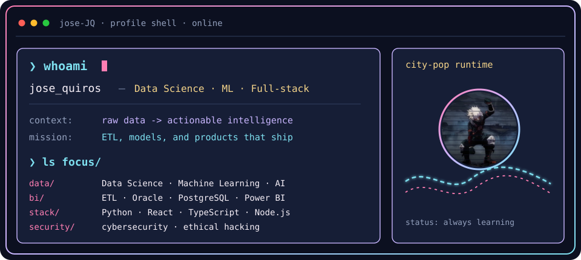

<a href="https://github.com/jose-JQ">
  <picture>
    <source media="(prefers-color-scheme: dark)" srcset="assets/banner-dark.svg">
    <source media="(prefers-color-scheme: light)" srcset="assets/banner-light.svg">
    
  </picture>
</a>

 

# 👋 Hi, I'm José Quiros ([@jose-JQ](https://github.com/jose-JQ))

<picture>
  <source
    media="(prefers-color-scheme: dark)"
    srcset="https://raw.githubusercontent.com/platane/snk/output/github-contribution-grid-snake-dark.svg"
  />
  <source
    media="(prefers-color-scheme: light)"
    srcset="https://raw.githubusercontent.com/platane/snk/output/github-contribution-grid-snake.svg"
  />
  
</picture>

## `$ whoami`

  

I'm highly passionate about computer science, driven by the power of **technological innovation** and the potential of **Data Science**, **Machine Learning**, and **Artificial Intelligence** to solve real-world problems.

Currently, I focus on bridging the gap between raw data and actionable intelligence—whether that involves designing robust ETL pipelines, exploring sequence-aware recommender systems, or building full-stack applications.

## `$ cat tech-stack.yaml`

<table border="1" cellpadding="14" bgcolor="#12182C">
  <thead>
    <tr>
      <th colspan="2" align="left"><code>jose-JQ:~$ cat tech-stack.yaml</code></th>
    </tr>
  </thead>
  <tbody>
    <tr>
      <td width="58%" valign="top"><code>├─ ✦ data_science_&amp;_ml:</code>  
        
        
        
        
        
        
        
        
        
      </td>
      <td width="42%" valign="top"><code>├─ ▣ databases_&amp;_bi:</code>  
        
        
        
        
      </td>
    </tr>
    <tr>
      <td colspan="2" valign="top"><code>├─ ⚙ full_stack:</code>  
        
        
        
        
        
        
        
        
        
        
      </td>
    </tr>
    <tr>
      <td colspan="2" valign="top"><code>╰─ ⌁ exploring:</code>  
        
        
      </td>
    </tr>
  </tbody>
  <tfoot>
    <tr>
      <td colspan="2"><code>status: building&nbsp;&nbsp;·&nbsp;&nbsp;focus: data · ml · full-stack</code></td>
    </tr>
  </tfoot>
</table>

### 🛠️ Tech Stack & Areas of Focus
* **Data Science & ML:** Predictive analytics, time-series forecasting, and algorithmic fairness in AI.
* **Business Intelligence:** Data integration, complex database management (Oracle, PostgreSQL), and automated reporting (Power BI).
* **Software Development:** Building modular solutions with Python, React, TypeScript, and Node.js.

## `$ cat skills-radar.log`

  <picture>
    <source media="(prefers-color-scheme: dark)" srcset="assets/radar-dark.svg">
    <source media="(prefers-color-scheme: light)" srcset="assets/radar-light.svg">
    
  </picture>

<code>signals: data_skill_radar · self_rated · status: healthy</code>

### 🌟 Beyond the Code
I’m extremely curious and always looking to expand my horizons.

> *"I love learning a lot of new things! I enjoy cooking, swimming, and playing video games. Computer science is truly impressive!"*

---

## 🚀 What I'm Passionate About

- 🤖 Artificial Intelligence & Machine Learning
- 📊 Data Science & Automation
- 🛡️ Cybersecurity & Ethical Hacking
- 🧩 Continuous Learning :)

---

## 📫 Let's Connect

---

## 📈 GitHub Stats

---

_✨ Let's build the future together through code, creativity, and innovation!_
