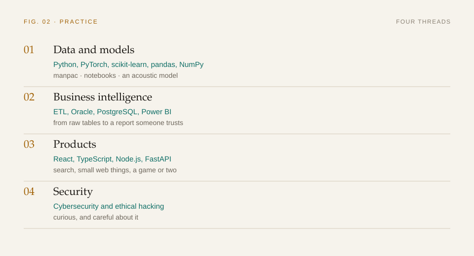

<a href="https://github.com/jose-JQ">
  <picture>
    <source media="(prefers-color-scheme: dark)" srcset="assets/banner-dark.svg">
    <source media="(prefers-color-scheme: light)" srcset="assets/banner-light.svg">
    
  </picture>
</a>

I'm highly passionate about computer science, driven by the power of **technological innovation** and the potential of **Data Science**, **Machine Learning**, and **Artificial Intelligence** to solve real-world problems.

Currently, I focus on bridging the gap between raw data and actionable intelligence—whether that involves designing robust ETL pipelines, exploring sequence-aware recommender systems, or building full-stack applications.

## What I work on

  <picture>
    <source media="(prefers-color-scheme: dark)" srcset="assets/practice-dark.svg">
    <source media="(prefers-color-scheme: light)" srcset="assets/practice-light.svg">
    
  </picture>

### Focus

* **Data Science & ML:** Predictive analytics, time-series forecasting, and algorithmic fairness in AI.
* **Business Intelligence:** Data integration, complex database management (Oracle, PostgreSQL), and automated reporting (Power BI).
* **Software Development:** Building modular solutions with Python, React, TypeScript, and Node.js.

### In public

- [manpac](https://github.com/jose-JQ/manpac) — reading vehicle invoices with models, then checking the result
- [Búsqueda IR](https://github.com/jose-JQ/busqueda_ir) — TF-IDF and BM25, with a React interface
- [Quantic Search](https://github.com/jose-JQ/rag_multimodal) — retrieval from text and images together
- [hci_tron_game](https://github.com/jose-JQ/hci_tron_game) — a game in TypeScript, with a small API beside it
- [Fueguito](https://github.com/jose-JQ/Fueguito) — a little flame that follows the cursor
- [Interpolador de funciones](https://github.com/jose-JQ/Interpolador-de-Funciones--ModSim) — an acoustic model

## Where my attention goes

  <picture>
    <source media="(prefers-color-scheme: dark)" srcset="assets/attention-dark.svg">
    <source media="(prefers-color-scheme: light)" srcset="assets/attention-light.svg">
    
  </picture>

## Beyond the code

I’m extremely curious and always looking to expand my horizons.

> *"I love learning a lot of new things! I enjoy cooking, swimming, and playing video games. Computer science is truly impressive!"*

## What I'm passionate about

- 🤖 Artificial Intelligence & Machine Learning
- 📊 Data Science & Automation
- 🛡️ Cybersecurity & Ethical Hacking
- 🧩 Continuous Learning :)

## Let's connect

## Activity

  <picture>
    <source media="(prefers-color-scheme: dark)" srcset="assets/snake-dark.svg">
    <source media="(prefers-color-scheme: light)" srcset="assets/snake-light.svg">
    
  </picture>

  <a href="https://github.com/jose-JQ">
    <picture>
      <source media="(prefers-color-scheme: dark)" srcset="https://github-readme-stats-eight-theta.vercel.app/api?username=jose-JQ&show_icons=true&include_all_commits=true&count_private=true&hide_border=true&title_color=E0A106&text_color=F4F0E6&icon_color=3CABA0&bg_color=12161C&border_color=24303A&ring_color=3CABA0">
      <source media="(prefers-color-scheme: light)" srcset="https://github-readme-stats-eight-theta.vercel.app/api?username=jose-JQ&show_icons=true&include_all_commits=true&count_private=true&hide_border=true&title_color=A16207&text_color=1C1915&icon_color=0F6E66&bg_color=F6F3EC&border_color=D4CBBA&ring_color=0F6E66">
      
    </picture>
    <picture>
      <source media="(prefers-color-scheme: dark)" srcset="https://github-readme-stats-eight-theta.vercel.app/api/top-langs/?username=jose-JQ&layout=compact&langs_count=8&hide_border=true&title_color=E0A106&text_color=F4F0E6&bg_color=12161C&border_color=24303A">
      <source media="(prefers-color-scheme: light)" srcset="https://github-readme-stats-eight-theta.vercel.app/api/top-langs/?username=jose-JQ&layout=compact&langs_count=8&hide_border=true&title_color=A16207&text_color=1C1915&bg_color=F6F3EC&border_color=D4CBBA">
      
    </picture>
  </a>

_✨ Let's build the future together through code, creativity, and innovation!_
